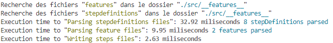

# bdd-generator

## Utilité
Les tests `jest-cucumber` sont parfois long à écrire, il faut d'abord définir les steps puis pour **chacun** des cas de test, écrie la fonction. Ce qui parfois double ou triple la taille du fichier. Ils doivent être écris à la main et peuvent provoquer des erreurs.

Avec ce package, nous pouvons écrire uniquement les steps.

---
## Installation

Voici la commande pour installer le package
`npm i -D @charlesgilles/bdd-generator`

---
## Configuration

Si vous souhaitez modifier cela, il vous faudra créer un fichier `bdd-generator.json`.
Voici les paramètres par défaut:
```json
{
    "lang": "en",
    "steps": "./src/__features__",
    "features": "./src/__features__",
    "ignoreGenerationTag": "ignore-generation",
    "onlyGenerationTag": "only-generation",
    "ignoreExecutionTag": "ignore",
    "onlyExecutionTag": "only",
    "forceStepsRegeneration": false
}
```
Les champs du fichier de paramétrage sont optionnels si vous souhaitez modifier soit l'un soit l'autre ou les deux.
Une erreur vous sera indiquée si l'un des path renseigné n'existe pas.

- lang: La langue du package. Les valeurs possibles sont `fr` et `en`
- steps: L'emplacement des fichiers .stepdefinitions.[tj]sx?
- features: L'emplacement des fichiers .feature
- ignoreGenerationTag: Le tag empéchant la génération du fichier steps correspondant. Le tag doit être au niveau de la Feature.
- onlyGenerationTag: Le tag permettant de ne générer que les fichiers demandés. Le tag doit être au niveau de la Feature.
- ignoreExecutionTag: Ajoute dans le fichier .steps généré l'indicateur qu'il faut ignorer l'exécution d'un test. Le tag doit être placé au niveau d'un Scenario
- onlyExecutionTag: Ajoute dans le fichier .steps généré l'indicateur qu'il ne faut exécuter que les tests correspondant. Le tag doit être placé au niveau d'un Scenario
- forceStepsRegeneration: Indique s'il faut regénéré en permanence les fichiers steps ou seulement lors de modifications

---
## Utilisation

### Les fichiers .feature
Les fichiers `.feature` sont les fichiers [gherkin](https://cucumber.io/docs/gherkin/) qui décrivent le comportement de votre application.

Exemple:
```gherkin
@utils
Feature: Calculatrice
En tant que mathématicien
Je veux pouvoir faire des opération basiques sur deux variables
Afin de vérifier que les calculs de Kévin ne sont pas bon

Background:
    Given La variable A est égale à "10"

Scenario Outline: <Operation> de deux nombres
    Given La variable B est égale à "-2"
    When J'effectue une "<Operation>"
    Then J'obtient le résultat "<Resultat>"

    Examples:
        | Operation      | Resultat |
        | addition       | 8        |
        | soustraction   | 12       |
        | multiplication | -20      |
        | division       | -5       |
```

### Les fichiers .stepdefinitions.[jt]sx?
Ce sont des fichiers javascript qui contiennent les définitions des steps
qui vont pouvoir être utilisées dans un ou plusieurs tests.

Exemples:

Fichier 1
```javascript
import { defineStep, defineFileScopes, scenarioContext } from "@charlesgilles/bdd-generator";

// Les steps de ce fichier ne pourront être utilisées que si le fichier 
// .feature à le tag @utils
defineFileScopes([
    {
        tag: 'utils'
    }
]);

defineStep(["then"], /J'obtient le résultat "(.*)"/, (resultat) => {
  expect(scenarioContext.resultat).toBe(Number(resultat));
});
```

Fichier 2
```javascript
import { defineStep, defineFileScopes, scenarioContext } from "@charlesgilles/bdd-generator";

// Les steps de ce fichier ne pourront être utilisées que si le fichier 
// .feature correspond à la feature indiquée
defineFileScopes([
    {
        feature: 'Calculatrice'
    }
]);

defineStep(["given"], /La variable A est égale à "(.*)"/, (a) => {
    scenarioContext.a = Number(a);
});

defineStep(["given"], /La variable B est égale à "(.*)"/, (b) => {
    scenarioContext.b = Number(b);;
});

defineStep(["when"], /J'effectue une "(.*)"/, (operation) => {
    switch (operation){
        case 'addition':
            scenarioContext.resultat = a + b;
            break;
        case 'soustraction':
            scenarioContext.resultat = a - b;
            break;
        case 'multiplication':
            scenarioContext.resultat = a * b;
            break;
        case 'division':
            scenarioContext.resultat = a / b;
            break;
        default:
            throw new Error(`L'opération "${operation}" n'existe pas`);
    }
});
```

Remarque: Ces fichiers supportent également le jsx.

---
### Comment fonctionne le package

Comme énoncé dans l'introduction du package, nous allons écrire uniquement les steps correspondants aux fichiers `.feature`. Le package va se charger tout simplement de générer les fichiers `.steps` qui vont être exécutés par le framework de test.

Un fichier `bdd-generator.hash.json` est créé lors de la génération. il est utilisé en complément du paramètre `forceStepsRegeneration`. Il contient l'ensemble des hashs des fichiers .features et .stepdefinitions.

---
### Comment utiliser le package

#### Les méthodes et objets disponibles
Les items suivants doivent être importées dans les fichiers `stepdefinitions.[jt]sx?` afin d'avoir l'inteliscence.

- `defineFileScopes`
permet de définir le scope de l'ensemble des steps du fichier.
Un scope peut être le nom de la feature, le nom d'un scénario ou d'un tag.

```javascript
defineFileScopes([
    {
        feature: 'Calculatrice'
    },
    {
        tag: 'test',
        scenario: 'Addition'
    }
]);
```
Avec l'exemple suivant, les steps du fichier pourront servir dans tout le fichier `.feature` dont le nom de la feature est `Calculatrice` **ou** dans les scénarios avec le tag `test` **ET** le nom de scénario `Addition`.

- `defineStep`
permet de définir une step. Les paramètres sont les suivants:
    1. Les `blocs` concernées, un tableau conposé de `Given`, `When` ou `Then`.
    2. Le `match`, la Regex ou la string correspondant à la step.
    3. Le `callback`: la fonction qui va être appelée lors du match.
    4. En paramètre optinnel, les `scopes` spécifiques à la step.

- `scenarioContext`
Le scenarioContext est la variable qui va contenir tout ce qui va être utilisé pendant l'exécution d'un __Scénario__, il transite entre les steps, d'où son nom.

---
#### La commande
Le package `bdd-generator` met à disposition une commande `bdd-generate`.
dans votre fichier `package.json`, il faut renseigner dans la partie scripts l'utilisation de cette commande.

Exemple:

```json
"scripts": {
    "test:generate": "bdd-generate",
    "test": "vitest",
    "vitest": "vitest --verbose"
},
```

Lors de l'exécution de la commande `npm run test:generate`, si vous avez bien écrit vos fichiers `.feature` et `.stepdefinitions.[jt]sx?`, vous aurez l'affichage suivant.



---
## Objectif

- [X] Génération des fichiers steps à partir des fichiers .feature et .stepdefinitions.[jt]sx?
- [X] Configuration du path des fichiers avec un fichier de configuration
- [ ] Configuration du path des fichiers avec des paramètres à la commande `bdd-generate`
- [X] Configuration des fichiers .feature à ignorer
- [ ] Avoir une commande `bdd-audit` qui permettrait d'obtenir la liste des steps qui se ressemblent en terme de nom. et pourquoi pas de code
- [X] Ajouter la possibilité d'avoir le package en Anglais et en Français
- [X] Si des fichiers stepdefinition et feature n'ont pas bougé, alors pas besoin de regénérer les fichiers steps correspondants